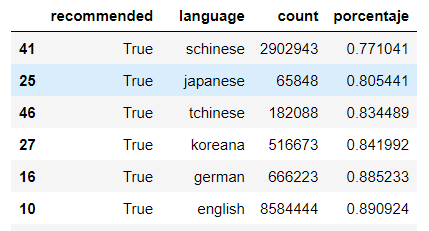
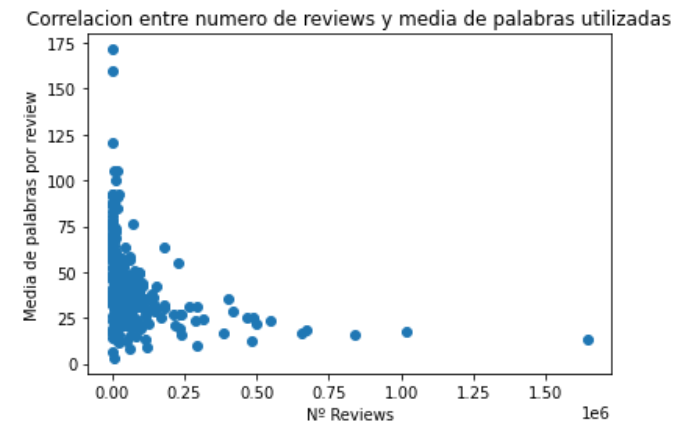
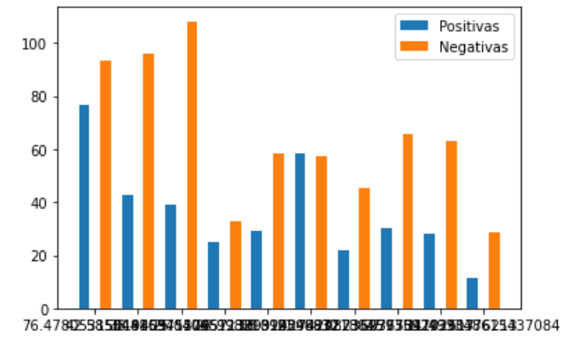
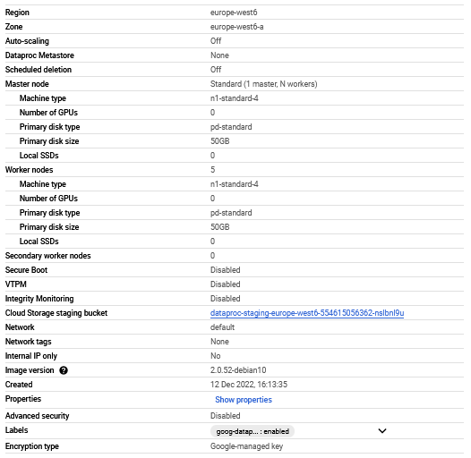
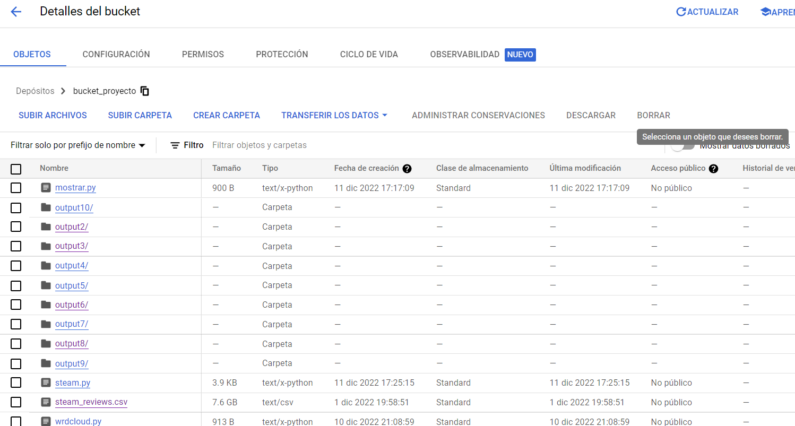
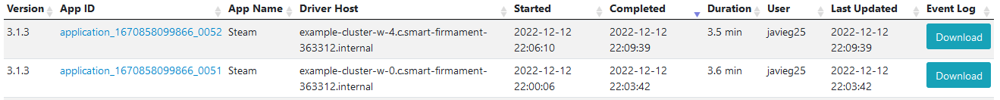
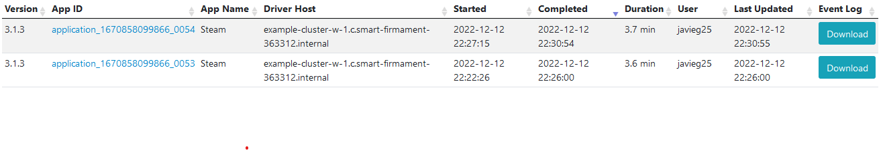

# Descripción del proyecto

Ánalisis relacional y estudio de mercado de alrededor de 21 millones reseñas de 300 diferentes videojuegos utilizando técnicas de big data y herramientas de cloud computing. El proyecto consiste en la realización de un análisis de las reviews que se han publicado en Steam en los útlimos años, con el fin de entender mejor las motivaciones de los usuarios a la hora de realizar una review o con el fin de extraer posibles correlaciones entre distintas variables que podrían explicar porque se producen ciertas reseñas. También hemos analizado los idiomas de las reseñas para ver diferencias a la hora de valorar un juego entre distintos países, y la cantidad de reseñas que tienen los juegos más populares o mejor valorados. 

## Necesidad de Big Data

Steam es una plataforma que cuenta con 69 millones de usuarios en activo, y aún muchísimos más que no usan la plataforma a diario pero que son usuarios de Steam. Al ser una plataforma tan popular y mundialmente conocida y usada, no se puede realizar un estudio de las reseñas si no contamos con una gran cantidad de datos. En este contexto donde el Big Data juega un gran valor. Algunos juegos tienen más de un millón de reseñas ellos solos por lo que es imposible no recurrir al Big Data para tratar las reseñas de más de 300 juegos como hemos hecho nosotros. 
Junto al Big Data hemos usado computación en la nube para realizar el estudio, gracias a su gran capacidad de procesamiento de datos y almacenamiento de archivos.

## Dataset de reviews

Los datos han sido obtenidos de Kaggle, una pagina web que contien una gran cantidad de datasets
para que cualquier persona pueda trabajar sobre ellos. En nuestro caso, vamos a utilizar 2 datasets 
que han sido extraídos de la api de la plataforma de Stream. El primero de ellos, que es el dataset de reviews, contiene alrededor de 21 millones de 
reseñas, escritas en distintos idiomas, de 300 videojuegos.

La estructura del dataset de reseñas es la siguiente: app_id, app_name, review_id, language, review, timestamp_created,
timestamp_updated, recommended, votes_helpful, votes_funny, weighted_voted_score, comment_count, steam_purchase, 
received_for_free, written_during_early_access, author.steamid, author.num_games_owned, author_num_reviews, author.playtime_forever,
author.playtime_at_review, author.last_played.

Para el análisis de los datos no hemos usado toda la informacion de ambos datasets, sino que hemos elegido ciertas columnas. Del primer 
dataset, el de las reseñas, hemos usado: app_name, language, review, timestamp_created, recommended, votes_helpful.

Link del dataset: [Dataset](https://www.kaggle.com/datasets/najzeko/steam-reviews-2021)

## Dataset de Juegos

Complementado el dataset anterior, también hemos utilizado un conjunto de datos algo más pequeño que incluye información de 40000 juegos en Steam. Al igual que con el dataset anterior lo hemos obtenido a través de Kaggle. Su tamaño es de 80Mb y la estructura que presenta es la siguiente: 
"url", Url of a game, "types", type of package - app, sub or bundle, "name", Name of a game, "desc_snippet", short description of a game, "recent_reviews", recent reviews, "all_reviews", all reviews, "release_date", release date, "developer", developer of a game, "publisher", publisher or publishers of a game.

De todos estos datos hemos utilizado sobre todo el género del juego, para poder estudiar cuáles son los generos más populares o los que generan más cantidad de reviews, complementándose con el otro dataset. 

Link del dataset: [Dataset](https://www.kaggle.com/datasets/trolukovich/steam-games-complete-dataset)

## ¿Cómo se puede ejecutar el código?
Vamos a ver las distintas formas en las que se puede ejecutar nuestro trabajo

* Usar Spark en local:

    Para poder ejecutar el código que realiza un procesamiento de los datos, es necesario instalar Java en tu dispositivo Linux. Se puede instalar con el siguiente comando:

      *sudo apt install default-jre*

    Una vez instalado, comprobamos que verdaderamente se ha instalado con el siguiente comando:

      *java -version*

    También se necesita Python, pero no es necesario instalarlo porque suele suele venir instalado por defecto en Linux.

    Habiendo instalado Java, es momento de instalar Spark:

      *curl -O https://archive.apache.org/dist/spark/spark-3.3.1/spark-3.3.1-bin-hadoop3.tgz*

      *tar xvf spark-3.3.1-bin-hadoop3.tgz*

      *sudo mv spark-3.3.1-bin-hadoop3 /usr/local/spark*

      *echo 'PATH="$PATH:/usr/local/spark/bin"' >> ~/.profile*

      *source ~/.profile*

    Se cargan los archivos necesarios.

    Ahora que está instalado Spark y los archivos necesarios están cargados, se puede realizar el procesamiento de datos mediante el envío de trabajos a Spark con el siguiente comando:

      *spark-submit yourFile.py inputFile(s).extension outputFile(s).extension (opcional)*
  
* Usar un Cluster Hadoop en Google Cloud:

    Para poder ejecutar el código que procesa los datos, es necesario crear un cluster Hadoop. Se puede utilizar una región cualquiera, en nuestro caso hemos utilizado europe-west6. Para crearlo, se puede utilizar el siguiente comando:

      *gcloud dataproc clusters create nombre-cluster --region europe-west6 --enable-component-gateway --master-boot-disk-size 50GB --worker-boot-disk-size 50GB*

    Una vez creado el cluster, es necesario crear un bucket donde se almacenarán, tanto los archivos con los datos, como los archivos de entrada y salida.

    Para crear un cluster, es necesario especificar una región, que puede ser cualquiera de las disponibles.

    Ahora es momento de subir al cluster los archivos que contienen los datos, y los archivos de contienen el código para procesar los datos.

    Habiendo subido todos los archivos necesarios al bucket, para poder realizar el procesamiento de datos mediante el envío de trabajos a Spark, es necesario especificar el bucket, que se puede hacer con el siguiente comando:

      *BUCKET=gs://nombre-bucket*

    Procedemos a enviar el trabajo a Spark:

      *gcloud dataproc jobs submit pyspark --cluster nombre-cluster --region=europe-west6 $BUCKET/archivoParaProcesar.py -- $BUCKET/archivo(s)DeDatos $BUCKET/output(s)*

    También se puede realizar una ejecución paralela con distintos nodos mediante las siguientes opciones, pero ejecutándolo desde el nodo master del cluster con el comando:

      *spark submit --num-executors numExecutors --executor-cores numCores <script>*
     
## Desarrollo 

En los siguientes enlaces podéis obtener toda la información relevante del trabajo.
En la carpeta de [Códigos](https://github.com/danicobos01/danicobos01.github.io/tree/main/C%C3%B3digos) podéis acceder a todo el código en lenguaje Python que hemos utilizado.
* En ["steam.py"](https://github.com/danicobos01/danicobos01.github.io/blob/main/C%C3%B3digos/steam.py) tenemos las distintas funciones que hemos utilizado para generar nuevos csvs a partir del conjunto de datos inicial. Con estos csvs más adelante hemos elaborado un cuaderno de jupyter notebook que contiene todo el análisis de mercado
* En ["reducirDatasetID.py"](https://github.com/danicobos01/danicobos01.github.io/blob/main/C%C3%B3digos/reducirDatasetID.py) tenemos el proceso llevado a cabo para unir los dos conjuntos de datos que hemos usado, para poder acceder a información relevante de ambos conjuntos. 
* En ["wordCountREVIEW.py"](https://github.com/danicobos01/danicobos01.github.io/blob/main/C%C3%B3digos/wordcountREVIEW.py) tenemos el código que hemos desarrollado para poder generar wordClouds a través de las reviews del conjunto de datos. Dichas nubes de palabras se analizarán en el notebook donde hemos hecho el análisis. 
* En ["difYearReviews.py"](https://github.com/danicobos01/danicobos01.github.io/blob/main/C%C3%B3digos/difYearReviews.py) tenemos el método utilizado para analizar el número de reviews de cada juego por año, con el fin de ver algún cambio respecto al número de reviews producidas cada año.

En la carpeta de [CSVs generados](https://github.com/danicobos01/danicobos01.github.io/tree/main/CSVs%20generados) podeis acceder a todos los csvs que se han generado a partir de las funciones
Estos csvs se pueden ver con mayor detalle en el notebook dónde hemos realizado el análisis. 

En el siguiente [Enlace](https://github.com/danicobos01/danicobos01.github.io/tree/main/Notebooks) podeis encontrar los distintos notebook en los que hemos realizado el ánalisis de las reseñas. 
* En ["csv_steam.ipynb"](https://github.com/danicobos01/danicobos01.github.io/blob/main/Notebooks/csv_steam.ipynb) tenemos un notebook que cuenta con distintos apartados en los que analizamos distintos aspectos del conjunto de datos, como el numero medio de palabras utilizadas o los idiomas de las mismas. También se han estudiado distintas correlaciones para encontrar patrones a la hora de hacer reseñas. Este cuaderno está guiado para entender el análisis que se ha llevado a cabo sin necesidad de más explicaciones, ya que es el cuaderno que contiene más cantidad de análisis de la carpeta
* En ["categorias.ipynb"](https://github.com/danicobos01/danicobos01.github.io/blob/main/Notebooks/categorias.ipynb) tenemos el estudio de los juegos más populares relacionado con los géneros de los mismos. En este cuaderno estudiamos que géneros son los más populares al igual que el tipo de juego, ya sea free-to-play o de pago. 
* En ["YearDifference.ipynb"](https://github.com/danicobos01/danicobos01.github.io/blob/main/Notebooks/YearDifference.ipynb) tenemos un breve cuaderno en el que estudiamos la diferencia entre la cantidad de reviews según el año de su publicación. 

Sin embargo, aunque toda la información del proyecto esté en los enlaces anteriores, vamos a escribir por aquí algunos puntos que hemos encontrado interesantes y que contamos con mayor detalle en los cuadernos: 

* Los asiáticos son los más exigentes a la hora de valorar un juego: 

    
    
    
    Haciendo el análisis nos hemos dado cuenta de una cosa curiosa y es que al ordenar el porcentaje de reviews favorables por orden ascendente vemos que los tres idiomas con menor puntuación son el chino, el japonés y el coreano. Esto nos ha llevado a la conclusión de que los asiáticos suelen escribir más reviews negativas que el resto de gente aunque sigue siendo un porcentaje favorable. 
    
    
    

* Hay una leve correlación entre el número de palabras medio de las reviews de un juego y el número de reviews del mismo:
    
    
    
    Calculando la correlación observamos un valor de -0.3, lo cual sin ser un coeficiente de correlación lo suficientemente grande para asegurar nada si que nos permite intuir que cuántas mas reviews tenga un juego menor será el numero de palabras medio por cada review. Esto pega con la tendencia que hay a la hora de hacer reviews de ser más excueto. Hay una tendencia a escribir reviews cortas por encima de largas. 
    
    

* El número de reviews ha ido aumentando cada año: 

    
    
    Podemos ver como ha ido aumentando linealmente el número de reviews con los años llegando a un pico en 2020, probablemente debido a que por la pandemia y cuarentena el número de gente que jugaba era mayor. Seguramente el valor de 2021 se pareceria más a 2019 que lo que muestra la gráfica pero el dataset del cual hemos obtenido los datos se generó antes de que acabase 2021.

    
    

* 9 de cada 10 juegos tiene reviews negativas más largas que reviews positivas:
    
    
    
    Para ser exactos, el 93% de los juegos que se incluyen en el dataset presentan el caso en el que las reviews negativas son más extensas que las reviews positivas. Esto sigue la tendencia real que tenemos como seres humanos de explayarnos o fijarnos más en los aspectos negativos que en los positivos. 
    

Estos solo son algunos de los puntos interesantes que se pueden encontrar en los cuadernos de jupyter dónde hemos hecho los análisis. 

## Rendimiento

Por la magnitud del tamaño de datos y la calidad de los ordenadores de los miembros del proyecto, ha resultado imposible analizar el rendimiento usando spark en Local, aunque sabemos que habría sido algo peor en comparación con el uso de Cluster Hadoop en Cloud, que es como hemos desarrollado el trabajo. 

El clúster que hemos utilizado mayotiramiente sigue las siguientes especificaciones: 

El bucket que hemos utilizado (sin las carpetas de output inicialmente):

Para realizar pruebas de rendimiento hemos enfrentado dos casos:

* 3 Worker nodes vs 5 Worker nodes: 

    

Como vemos la diferencia es mínima y casi no hay diferencia entre usar tres nodos trabajadores o cinco. 

* 3 Executors vs 4 Executors (ambos con 4 cores):

    

Aquí vuelve a ser mínima la diferencia como en el apartado anterior.

En definitiva, no hemos llegado a ninguna conclusión clara ya que no es de mucha utilidad si no podemos compararlo con spark en modo local. De todas formas nuestro motivo para decantarnos por el cluster en hadoop se ha basado más en motivos de familiaridad con el entorno que en motivos de rendimiento.

## Conclusiones

En cuanto al análisis y estudio de mercado hemos aprendido algunas cosas interesantes como que los juegos de acción son los más populares en las plataforma mientras que los de simulación de deportes son mucho menos populares. Hemos visto que los asiáticos son más exigentes a la hora de valorar videojuegos, o que la media de valoración de todos los videojuegos gira en torno al 8.5 en la plataforma. Hemos visto que el inglés es el idioma más utilizado en las reseñas, o que hay algunas palabras como "good", "great" o "much" que se repiten con mucha frecuencia en las reseñas positivas, etc.

En resumen, creemos que a partir de un conjunto de datos grande pero algo limitado en cuanto a número de columnas hemos sacado resultados que pueden parecer interesantes y útiles para saber como funciona el sistema de reseñas en Steam. Cabe destacar que el proyecto nos ha resultado muy interesante por la libertad que hemos tenido para poder investigar y usar los datos a nuestro antojo, promoviendo así la originalidad por parte de todos los miembros del grupo. También nos gustaría seguir investigando en el futuro tanto sobre cloud como sobre este proyecto, para sacar nuevas y mejores conclusiones

